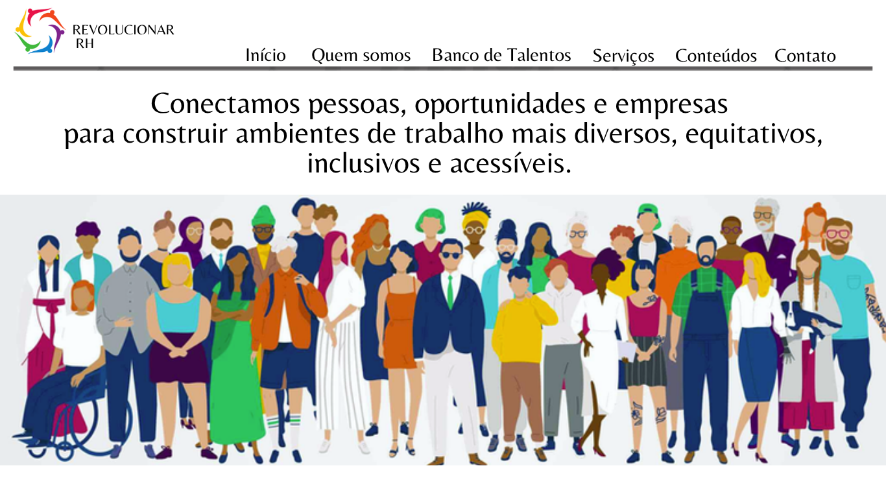
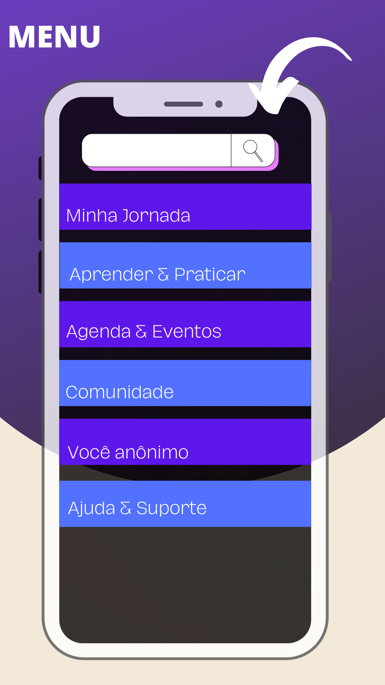

# Revolucionar RH 💜

### Diversidade, Equidade, Inclusão e Acessibilidade no ambiente de trabalho

O **Revolucionar RH** é um projeto voltado à construção de ambientes de trabalho mais diversos, equitativos, inclusivos e acessíveis, conectando talentos a oportunidades e apoiando organizações no desenvolvimento de práticas de Diversidade, Equidade e Inclusão (DE&I).

O projeto nasceu em **2023**, como um trabalho acadêmico desenvolvido em dupla durante minha formação em Recursos Humanos. A proposta inicial surgiu a partir da identificação de desafios relacionados à diversidade e inclusão no mercado de trabalho e resultou na criação dos protótipos de um **site e aplicativo**.

Em **2026**, o projeto iniciou uma nova etapa. O site e o aplicativo foram revisados e atualizados, incorporando uma visão mais atual sobre DE&I, acessibilidade, experiência dos colaboradores e acompanhamento de indicadores.

Atualmente, o Revolucionar RH continua em desenvolvimento e será utilizado também como um projeto de aprendizagem, permitindo que novos conhecimentos adquiridos durante minha graduação em **Ciência de Dados** sejam aplicados gradualmente à solução.

## 💡 Solução

O Revolucionar RH é composto por duas frentes principais:

- **Site:** conecta profissionais a oportunidades por meio de um Banco de Talentos e apresenta soluções para empresas, como recrutamento inclusivo, consultoria em DE&I e ações de educação e desenvolvimento.

- **Aplicativo:** pensado para colaboradores das organizações atendidas, reunindo recursos de aprendizagem, eventos, comunidade, diagnóstico de DE&I, indicadores, Comitê de DE&I e um espaço confidencial de escuta chamado **Você Anônimo**.
- ## 💻 Site Revolucionar RH

O site representa a frente externa do projeto, conectando profissionais a oportunidades e apresentando às organizações as soluções oferecidas pelo Revolucionar RH.

Entre suas principais áreas estão:

- Banco de Talentos
- Consultoria em DE&I
- Recrutamento Inclusivo
- Educação e Desenvolvimento
- Conteúdos sobre diversidade, inclusão e acessibilidade

### Protótipo

📁 As demais telas estão disponíveis na pasta [`site`](site/).

## 📱 Aplicativo Revolucionar RH

O aplicativo foi pensado para apoiar os colaboradores das organizações atendidas, criando um ambiente de aprendizagem, participação e acompanhamento das iniciativas de DE&I.

Entre as funcionalidades propostas estão:

- Minha Jornada
- Aprender & Praticar
- Agenda & Eventos
- Comunidade
- Você Anônimo
- Comitê de DE&I
- Diagnóstico e Indicadores de DE&I

### Protótipo

📁 As demais telas estão disponíveis na pasta [`app`](app/).

## 🚀 Evolução do projeto

Este repositório acompanhará a evolução contínua do Revolucionar RH.

Conforme avanço nos estudos, pretendo explorar a aplicação de **análise de dados, SQL, Python, visualização de dados e People Analytics**, transformando os dados e indicadores do projeto em novas possibilidades de análise e acompanhamento.

> 🚧 **Status: Projeto em desenvolvimento.**
